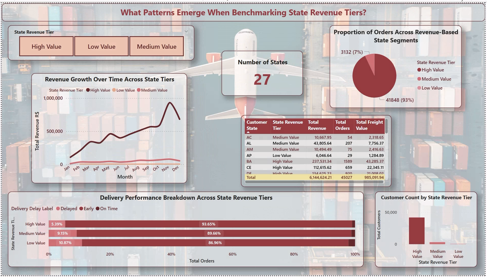

# 📦 E-Commerce Sales and Delivery Dashboard (Power BI)

## 📘 Project Overview

This project delivers an interactive Power BI dashboard built using real-world data from a Brazilian e-commerce platform. It offers a deep dive into how customer behavior, product categories, logistics, and delivery timelines affect overall business performance. Designed for data-driven decision-making, this dashboard allows stakeholders to explore the performance of regions, products, and customers with just a few clicks.

---

## 🎯 Objectives

- Understand order distribution across Brazilian states
- Analyze the causes and frequency of delivery delays
- Compare revenue and freight costs by product category
- Segment customers based on purchase volume and value
- Present insights in a professional, interactive Power BI format

---

## 💼 Business Use Cases

- 📍 **Logistics Teams**: Identify cities with frequent delivery issues  
- 💰 **Finance Teams**: Track revenue efficiency and freight cost impact  
- 🛒 **Marketing Teams**: Segment top-performing customers and regions  
- 📦 **Product Teams**: Evaluate product category profitability  
- 🧑‍💼 **Executives**: Monitor business KPIs across time and geography

---

## 📊 Dashboard Sections & Insights

### 1️⃣ Order Volumes by State
- Visualizes monthly order trends during 2017  
- Highlights the top-performing states in terms of order count  
- Allows state-level filtering to isolate patterns  
📌 **Insight:** São Paulo and Rio de Janeiro dominate order volume  

---

### 2️⃣ Delivery Delay Analysis
- Tracks average delivery delays by city and product category  
- Shows correlation between delivery time and product weight/freight cost  
- Identifies high-delay regions for logistics optimization  
📌 **Insight:** Heavier items and distant cities have higher delays  

---

### 3️⃣ State Revenues Overview
- Categorizes states by revenue tiers (High, Medium, Low)  
- Displays freight and order distribution by state  
- Analyzes revenue contribution by location over time  
📌 **Insight:** A few southern states contribute over 60% of revenue  

---

### 4️⃣ Revenue by Product Categories
- Shows total revenue and freight cost by product category  
- Compares revenue efficiency (revenue per unit freight)  
- Highlights low-margin and high-volume product segments  
📌 **Insight:** Some categories have high freight but low revenue impact  

---

### 5️⃣ Customer Analysis
- Ranks customers based on order volume and revenue contribution  
- Displays total customers, average spend, and peak order times  
- Helps in building customer segmentation strategies  
📌 **Insight:** A small percentage of customers drive most of the revenue  

---

## 📁 Project Files

- `E-Commerce Sales and Delivery Analysis.pbix` – Main Power BI report  
- `screenshots/` – Image previews of each report section

---

## 🧰 Tools & Skills Used

- **Microsoft Power BI Desktop**
- **Power Query** for data transformation
- **DAX** (Data Analysis Expressions) for custom metrics
- **Star Schema Modeling** for relational integrity
- **Slicers, Tooltips & Bookmarks** for interactivity
- **Scatter Maps, Pie Charts, Bar Charts, Line Charts**

---

## 🔍 Dataset Details

- **Source**: [Kaggle - Brazilian E-Commerce Dataset](https://www.kaggle.com/datasets/devarajv88/target-dataset)  
- **Includes**: Orders, products, reviews, geolocation, delivery times, freight values  
- **Time Period**: 2016 to 2018  
- **License**: Open public use (Kaggle)

---

## 🚀 How to Use

1. Clone the repo or download the `.pbix` file  
2. Open it in **Power BI Desktop**  
3. Explore pages using slicers and visual elements  
4. Filter by states, product categories, cities, or customers  
5. Replace the data source with your own to reuse the dashboard

---

## 📝 Notes

- Data has been fully cleaned and pre-aggregated inside Power BI using Power Query  
- DAX measures are optimized for performance and clarity  
- This dashboard is for educational, analytical, and portfolio purposes only

---

